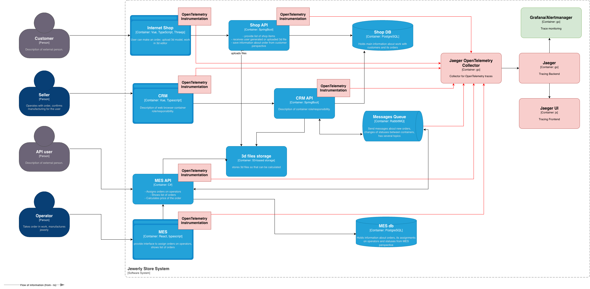

# Архитектурное решение по трейсингу

## Анализ системы и идентификация точек трейсинга

На основе C4-диаграммы и описания системы, заказ проходит через следующие компоненты: Customer -> Internet Shop -> Shop API -> Shop DB -> RabbitMQ -> CRM API -> CRM DB -> RabbitMQ -> MES API -> MES DB. Возможные точки поломок или зависаний:

- **Потеря сообщений в RabbitMQ**: Между Shop API и CRM, CRM и MES.
- **Ошибки в расчетах MES**: Длительные расчеты или таймауты.
- **Синхронизация БД**: Несоответствия статусов между Shop DB и MES DB.
- **Внешние интеграции**: API пользователи напрямую в MES.

Системы для покрытия трейсингом: Internet Shop, Shop API, CRM, CRM API, MES, MES API, RabbitMQ, Shop DB, MES DB.

## Список данных для трейсинга

- Trace ID: Уникальный идентификатор трейса для всего пути заказа.
- Order ID: Идентификатор заказа.
- Timestamps: Время входа/выхода на каждом шаге (created, submitted, price_calculated, etc.).
- Actions/Spans: Названия операций (upload_file, calculate_price, send_message).
- Errors: Код ошибки, сообщение, если произошла.
- User/Context: Тип пользователя (customer, seller, operator), источник (web, api).
- Metadata: Размер файла, сложность модели, статус заказа.
- Duration: Продолжительность.
- Correlation ID: Уникальный идентификатор группы операций для связывания с логами.

## Мотивация

Трейсинг позволит команде видеть полный путь заказа через систему, диагностировать, где он завис или сломался, вместо ручного поиска по логам. Это даст:

- **Быструю диагностику**: Вместо дней на анализ - минуты на просмотр трейса.
- **Проактивное обнаружение**: Автоматический алертинг на зависшие заказы.
- **Улучшение надежности**: Снижение процента потерянных заказов.

Технические метрики:
- Среднее время end-to-end обработки заказа (latency).
- Процент заказов с ошибками (error rate).
- Количество потерянных сообщений в очередях.

Бизнес-метрики:
- Процент просроченных заказов.
- Уровень удовлетворенности клиентов (NPS).
- Время на разрешение инцидентов.

## Предлагаемое решение

Предлагается использовать OpenTelemetry, как стандарт для инструментирования кода и экспорта данных и Jaeger в качестве бэкенда для хранения и визуализации трейсов. Будет внедрен новый компонент OpenTelemetry Collector - центральный агент для приёма телеметрии от всех сервисов, который будет обрабатывать и экспортировать данные в бэкенд. Для java используем библиотеку opentelemetry-java-instrumentation, а для .net OpenTelemetry - они автоматически инструментируют HTTP-запросы и запросы к БД. Для RabbitMQ можно настроить автоматическое прокидывание Trace ID через хэдеры сообщений.

Компоненты:

- **Инструментация**: Добавить OpenTelemetry SDK в Java (Spring Boot) и C# (MES API) приложения. Генерировать spans для каждого шага (API calls, DB queries, message sends).
- **Коллектор**: OpenTelemetry Collector для сбора и отправки трейсов в Jaeger.
- **Хранилище**: Jaeger с Elasticsearch для хранения трейсов.
- **Визуализация**: Jaeger UI для просмотра трейсов.

[Обновленная C4 диаграмма](./c4_model.drawio)

## Компромиссы

- **Legacy код**: MES на C# может требовать значительной доработки для OpenTelemetry.
- **Производительность**: Overhead на CPU/память от генерации трейсов (1-5% в зависимости от нагрузки).
- **Стоимость**: Развертывание Elasticsearch и Jaeger в Yandex Cloud добавит расходы на инстансы.
- **Не для всех компонентов**: RabbitMQ может не поддерживать полную трейсинг-интеграцию без кастомных плагинов.
- **Сложность**: Увеличит сложность системы, требует обучения команды.

## Аспекты безопасности

- **Аутентификация**: Доступ к Jaeger UI только для сотрудников с ролью "Support" через SSO (Yandex Passport).
- **Авторизация**: Ролевая модель - разработчики видят все, поддержка - только заказы.
- **Шифрование**: Трейсы передаются по HTTPS, хранение в зашифрованных базах.
- **Аудит**: Логи доступа к трейсам.
- **Изоляция**: Jaeger в отдельной VPC, без внешнего доступа (только VPN).