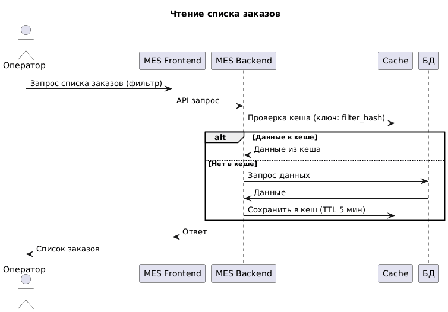
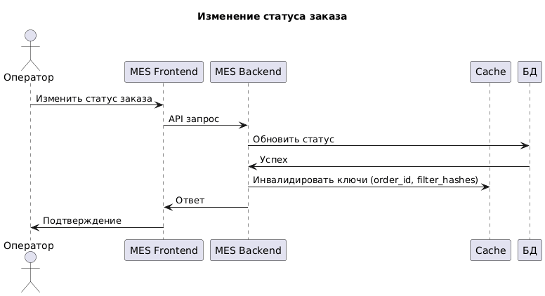

# Архитектурное решение по кешированию

## Мотивация

### Почему нужно кеширование
MES испытывает проблемы с производительностью: операторы жалуются на медленную загрузку дашборда (список заказов с фильтрами и пагинацией), что влияет на их работу и вознаграждения. Клиенты недовольны просроченными заказами, хотя производство может справиться. Кеширование снизит нагрузку на базу данных, ускорит чтение данных и улучшит пользовательский опыт.

### Проблемы, которые решит
- Медленная загрузка списка заказов в MES.
- Высокая нагрузка на БД при частых запросах.
- Задержки в обновлении статусов заказов.

### Элементы для кеширования
- Список заказов с фильтрами (по статусу, дате).
- Детали заказов (для быстрого доступа).
- Результаты расчетов стоимости (если повторяются).

## Предлагаемое решение

### Тип кеширования
Серверное кеширование, так как данные динамичны, и клиентское не подходит для многопользовательской системы. Серверное позволяет централизованно управлять кешем и обеспечивать консистентность.

### Стек для кеширования
Выбран Redis: Это in-memory хранилище, поддерживающее TTL, ключи, хэши и списки, что идеально для Cache-Aside. Быстрый (микросекунды), масштабируемый, интегрируется с C# (StackExchange.Redis), распределенный.

### Паттерн кеширования
Cache-Aside: При чтении проверяем кеш, если нет — загружаем из БД и кешируем. При записи обновляем БД и инвалидируем кеш. Подходит, так как чтение чаще записи, и позволяет избежать сложностей Write-Through (синхронные обновления) или Refresh-Ahead (прогнозные обновления, не всегда точны).

### Диаграмма последовательности

### Стратегия инвалидации
По ключу с TTL: Кеш имеет TTL (5-10 мин) для автоматической инвалидации. При изменении статуса — явная инвалидация связанных ключей. Подходит, так как данные меняются редко, но важно актуальность. Временная инвалидация проста, но может дать устаревшие данные; программная (event-based) сложнее реализовать без очередей.

### Сравнение стратегий инвалидации

| TTL + По ключу | Программная (Event-based) | Временная |
|----------------|---------------------------|-----------|
| Лучше подходит, потому что баланс простоты и актуальности | Позволяет точную инвалидацию, но требует очередей (RabbitMQ) | Простая, но риск устаревших данных |
| Особенности: TTL для автоочистки, инвалидация по событиям | Минусы: Сложность, задержки | Не позволяет точную инвалидацию |

Выбор: TTL + По ключу, так как оптимально для MES.
